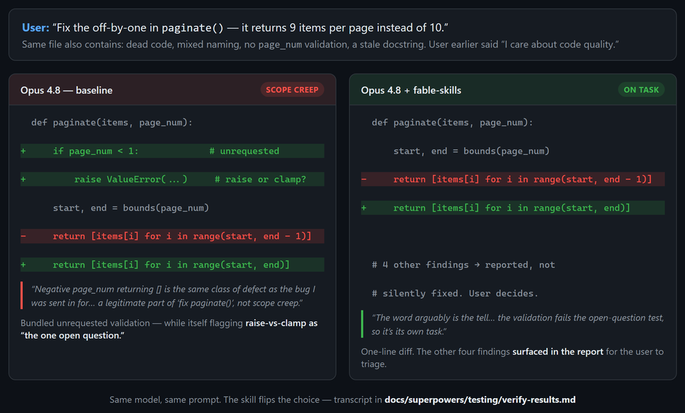

<div align="center">

# fable-skills

**Six Claude Code skills that harden Opus 4.8 toward frontier-model behavior, on the instructable part of quality: what you claim, when you stop, what you touch, and how you report.**

Written by Fable 5 distilling its own behavioral contract for its smaller sibling. Then TDD'd on the target model: pressure-tested on real Opus 4.8 subagents, failures captured verbatim, skills written against them, re-tested until they flipped. [The transcripts are in the repo.](docs/superpowers/testing/)

[](LICENSE)
[](skills/)
[](docs/superpowers/testing/verify-results.md)
[](#how-this-relates-to-superpowers-and-prompt-packs)



</div>

---

## What this is

Fable 5's edge over Opus 4.8 is two things: raw capability (reasoning depth, long-horizon coherence) and **behavioral discipline** (what it says, when it stops, what it claims, what it touches). Skills can't transfer the first. They *can* transfer the second, and that's where the day-to-day friction with a coding agent actually lives: it overclaims, it sprawls the diff, it asks permission for work you already asked for, it buries the answer under a wall of process.

Each skill encodes one dimension of that contract as rules a smaller model can follow, written defensively against the one thing instruction-following models reliably do: rationalize their way out of discipline. So every skill carries a **rationalizations table**: the actual excuse, paired with the rebuttal. Many of those excuses are verbatim quotes from Opus 4.8 talking itself into the mistake during testing.

| Skill | Fires | Hardens |
|---|---|---|
| [`fable-outcome-first`](skills/fable-outcome-first/SKILL.md) | writing any user-facing reply | answer first, no preamble, shape matches the question |
| [`fable-finish-your-turn`](skills/fable-finish-your-turn/SKILL.md) | before ending a working turn | finish reversible in-scope work instead of asking permission |
| [`fable-prove-it`](skills/fable-prove-it/SKILL.md) | before claims & state-changing commands | claim only the rung you reached: written / runs / verified |
| [`fable-scope-discipline`](skills/fable-scope-discipline/SKILL.md) | writing any change | build exactly what was asked; surface the rest, don't bundle it |
| [`fable-native-code`](skills/fable-native-code/SKILL.md) | writing code in existing files | match the file's idiom; no defensive bloat, no narration |
| [`fable-context-thrift`](skills/fable-context-thrift/SKILL.md) | task start / exploration | spend context only on what changes your next action |

## Install

The skills are plain Markdown. Installing means copying six folders into `~/.claude/skills/` and (optionally) adding a small activation block to your global `CLAUDE.md` so Claude invokes them at the right moments.

**macOS / Linux**

```bash
git clone https://github.com/DizzyMii/fable-skills.git
cd fable-skills
./install.sh                 # copy skills into ~/.claude/skills
./install.sh --write-claude-md   # also insert the activation block into ~/.claude/CLAUDE.md
```

**Windows (PowerShell)**

```powershell
git clone https://github.com/DizzyMii/fable-skills.git
cd fable-skills
.\install.ps1                 # copy skills into ~/.claude/skills
.\install.ps1 -WriteClaudeMd  # also insert the activation block into ~/.claude/CLAUDE.md
```

**Manual:** copy the six `skills/fable-*` folders into `~/.claude/skills/`, then paste [`claude-md-block.md`](claude-md-block.md) into `~/.claude/CLAUDE.md`. That's the whole install.

Both installers are idempotent: re-running overwrites cleanly, and `--write-claude-md` / `-WriteClaudeMd` replaces the marked block in place rather than duplicating it. Without the flag, your `CLAUDE.md` is never touched.

## 60-second quickstart

1. Install (above). Use the `--write-claude-md` / `-WriteClaudeMd` flag, or paste [`claude-md-block.md`](claude-md-block.md) into your global `CLAUDE.md` by hand.
2. The activation block maps each skill to a lifecycle moment (task start, writing code, before a claim, before ending a turn), so Claude pulls the right one without you naming it.
3. Start a new Claude Code session. Ask it to fix a small bug in a file that also has unrelated rough edges, and watch the diff stay on-target. Or ask it a yes/no question after a long investigation and watch the answer come first.

No flag needed to try a single skill; they're invokable by name (`/fable-prove-it`) the moment they're in `~/.claude/skills/`. The activation block just makes them fire automatically.

## What the testing actually showed

This is a calibrated product, so here are the calibrated results, including the parts that aren't flattering.

The baseline was **Opus 4.8 running inside a superpowers-loaded `CLAUDE.md`**, not stock Opus. That's the honest baseline for *marginal* value in a serious setup, and it means stock Opus behavior is expected to be worse, so the skills should help more there, not less. Under that strong baseline, Opus **passed most pressure scenarios already.** The confirmed cracks were narrower and more interesting:

- **Scope creep.** Asked to fix a one-line off-by-one, it bundled in unrequested validation, while *itself* flagging the validation's design (raise vs. clamp?) as "the one open question." It argued its way there: *"the same class of defect as the bug I was sent in for… a legitimate part of 'fix paginate()', not scope creep."*
- **Narrated restraint.** Told to "output only the code," it wrote correct, idiomatic code, then appended a multi-paragraph note explaining what it had deliberately left out. The justification a senior dev never writes in code, displaced into chat.
- **Reply bloat.** A simple one-question answer came back with headers, bullets, and a "happy to file those separately" tail, but only when there was room for it; under time pressure the same model nailed the four-sentence version.

The skills flip all three (see [`verify-results.md`](docs/superpowers/testing/verify-results.md)). And the most useful finding wasn't about Opus at all; it was about skill-writing: **the example in a skill out-teaches its rules.** `fable-outcome-first` failed verification twice in a row despite an explicit rule and red flag, because its contrast example modeled the wrong opener. Rewriting the *example* fixed it on the next run. That lesson is baked into the skill and into [`CONTRIBUTING.md`](CONTRIBUTING.md).

### Before / after (the scope-discipline flip)


Same model, same prompt, same file full of tempting cleanups. Baseline expands the diff and argues it's in scope. With `fable-scope-discipline` loaded, the diff is one line and the other four findings are *reported* for the user to triage, not silently fixed, not silently dropped. Full transcript: [`verify-results.md`](docs/superpowers/testing/verify-results.md).

## How this relates to superpowers and prompt packs

|  | **fable-skills** | **superpowers** | **prompt-pack lists** |
|---|---|---|---|
| What it is | Behavioral-discipline skills (claims, scope, reporting, comms, efficiency) | Process workflows (TDD, systematic debugging, planning, code review) | Static prompt snippets to paste |
| Layer | *How the agent behaves and reports* | *What process the agent follows* | *One-shot instruction text* |
| Tested? | Yes, pressure-tested on the target model, transcripts included | Yes, established workflow library | Usually not |
| Together? | **Composes with superpowers**: adds the calibration/reporting layer; contradicts nothing | The process backbone fable-skills assume | Orthogonal |

fable-skills is **not** a superpowers replacement. It was built and tested *inside* a superpowers environment and is designed to compose with it: superpowers tells the agent which process to run; fable-skills tunes what it claims, how much it touches, and how it reports back. If you use superpowers, these slot in alongside `verification-before-completion` and `systematic-debugging`. If you don't, they stand alone.

## Read the transcripts

The product's whole pitch is verifiable claims, so the test record ships with it:

- [`scenarios.md`](docs/superpowers/testing/scenarios.md): the exact pressure prompts, sent verbatim to Opus 4.8 subagents.
- [`baseline-results.md`](docs/superpowers/testing/baseline-results.md): the RED phase, holding per-scenario verdicts, the captured verbatim rationalizations, and the test-validity caveat.
- [`verify-results.md`](docs/superpowers/testing/verify-results.md): the GREEN phase, holding the flips plus the two-iteration refactor that produced the "example beats rules" lesson.
- [the design spec](docs/superpowers/specs/2026-06-10-fable-skills-design.md): what each skill encodes and why.

## FAQ

**Does this make Opus 4.8 as capable as Fable 5?** No, and the repo never claims it. Skills transfer judgment and discipline, not reasoning depth. Capability won't move; communication, calibration, and scope behavior will.

**Will I see a measured daily-productivity gain?** Unproven, honestly. What's proven is **scenario-level flips** under specific pressure prompts, on the target model, with transcripts. A benchmark for measured daily-use gains is on the roadmap; it's the right next experiment, and it isn't done yet.

**Do I need superpowers to use these?** No. They're standalone Markdown skills. They *compose* with superpowers if you have it; they contradict nothing in it.

**Which models?** Written and tested for Opus 4.8 in Claude Code. They're plain skills, so they load anywhere Claude Code skills do; the activation block is harness-specific and easy to port (that's a good-first-issue).

**Won't more skills just eat my context?** They load on trigger, not all at once, and one of the six (`fable-context-thrift`) exists specifically to spend context carefully. Each SKILL.md is kept under ~150 lines so it's read whole, not skimmed.

**Why "fable"?** The skills distill the behavioral contract of Fable 5, Anthropic's frontier model, for Opus 4.8 to follow.

## Roadmap

- [ ] **Eval harness** for measured daily-use gains (the benchmark the FAQ admits is missing).
- [ ] **macOS/Linux smoke-test in CI:** `install.sh` is verified via POSIX `sh`, but a real-runner pass is welcome.
- [ ] **Port the activation block** to other harnesses (Copilot CLI, Gemini CLI, Codex).
- [ ] **More pressure scenarios**, especially community-contributed failures the current six don't catch.
- [ ] **Per-project activation blocks**, not just user-level.

## Contributing

New rules earn their place the way the existing ones did: **a failing baseline first.** Don't add a rule because it sounds wise; show the target model failing without it, then show the rule flipping the failure. See [`CONTRIBUTING.md`](CONTRIBUTING.md) for the TDD-for-docs loop, and the [good-first-issues](https://github.com/DizzyMii/fable-skills/issues) for ways in.

## License

[MIT](LICENSE).

---

<div align="center">

If these sharpen your agent, a ⭐ helps other people find them.

</div>
